# Real-Time CV Object Tracking - YOLO26

**Point it at any live street camera. Get a working video-intelligence
station.**

One notebook turns a public webcam into a real-time analysis dashboard:
people and vehicles tracked with stable identities, license plates
located and read in two stages, skeletons drawn on every pedestrian,
fires confirmed before they alarm, parking spots discovered on their
own, and every detection archived with the frame that proves it. All of
it runs locally, on CPU, from a single `Run All`.

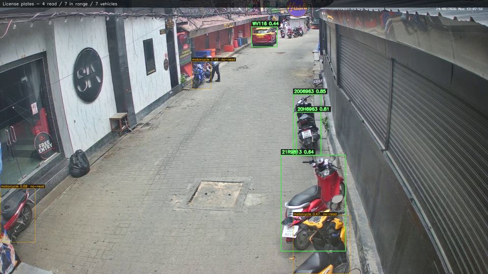

*Four plates read on one frame of a live Koh Samui street camera. Green
carries the OCR text and confidence; amber marks vehicles in range that
have not produced a confident read - the system never invents one.*

## Ten analysis layers, one at a time, on live video

| Layer | What it does |
|---|---|
| Paths | Per-object trails with stable identity colors and honest speed tiers. |
| Pose | Six-region skeletons with left/right limb separation on every pedestrian in range. |
| Gestures | Arm poses plus hand-landmark verdicts: open palm, fist, pointing with direction. |
| Body | Kinematic anomaly watch: sudden motion, fighting, posture-based fall suspects. |
| Faces | YuNet detection with a far-face rescue pass and a numbered, uniform display. |
| Heat | Full-frame thermal view accumulating dwell, with a verbal hottest-spot legend. |
| Line | Operator-drawn tripwire with direction-aware In/Out counters. |
| Fire | Dedicated fire + smoke detector, two-tick confirmation before the banner. |
| Parking | Spots discovered automatically from parked-vehicle persistence, live occupancy. |
| Plates | Two-stage LPR: plate finder inside each vehicle crop, then multi-script OCR with per-country grammar. |

## The layers, live

Every image below is real output of the shipping pipeline on live
street cameras in Thailand - no mockups, no staged scenes.

**Pose and skeleton.** Each person keeps one identity color; limbs are
told apart left from right.

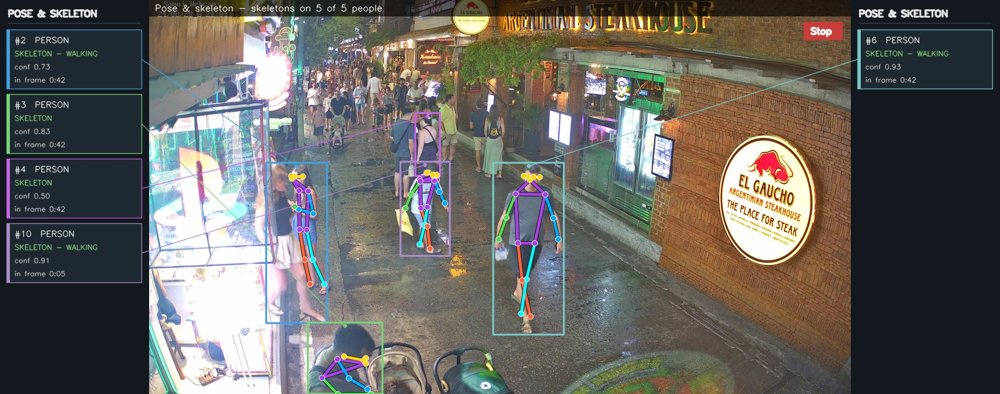
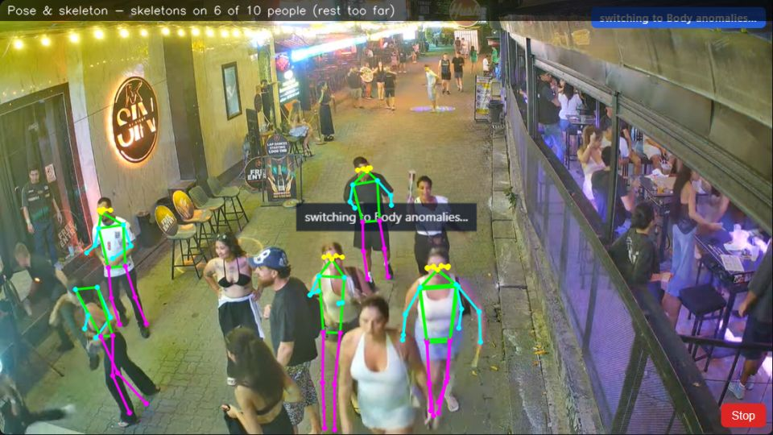

**Body anomalies.** Skeletons on everyone, red alert on the one that
matters.

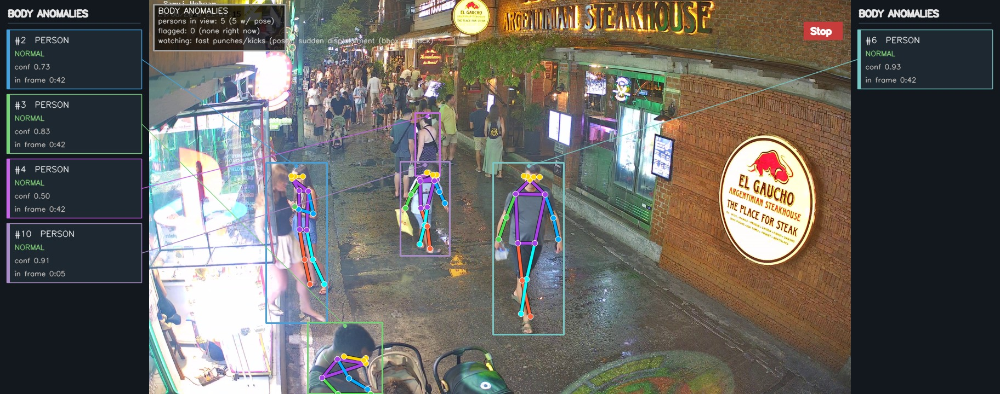
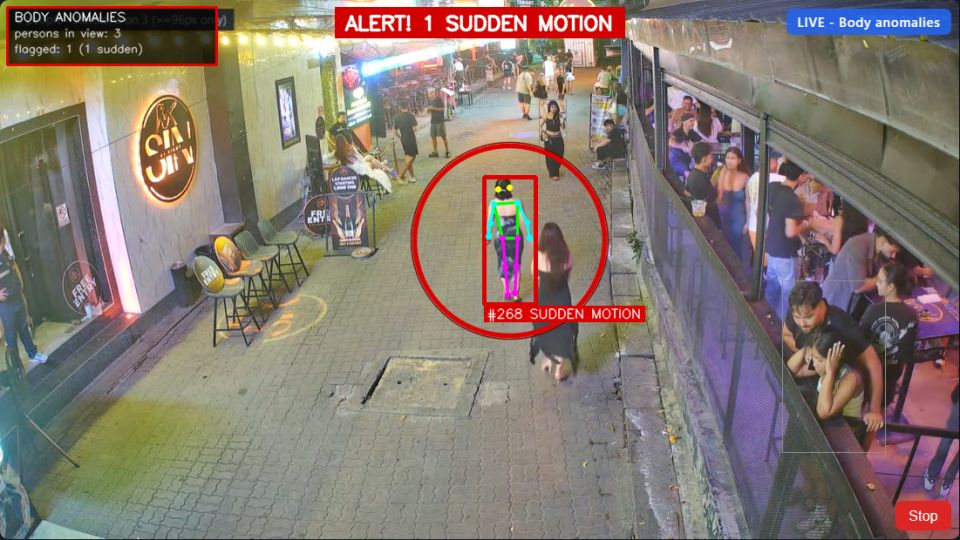

**Hand gestures.** Two open palms caught on a night street, from
21-point hand landmarks.

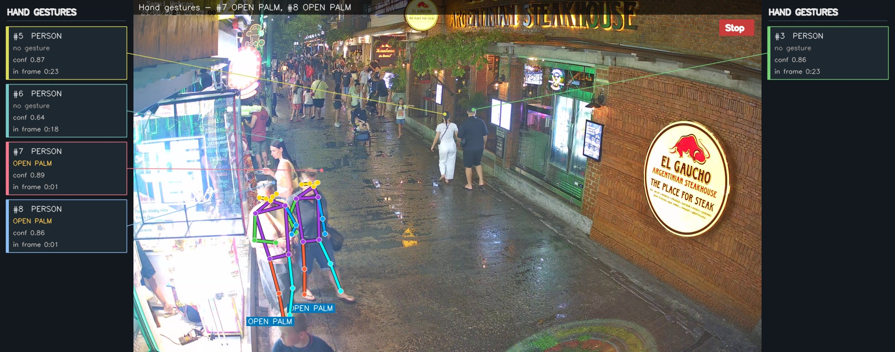

**Faces.** Numbered on the frame, uniform orange, far faces rescued by
a second-scale pass.

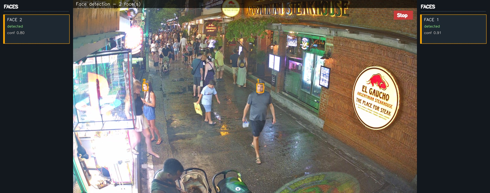
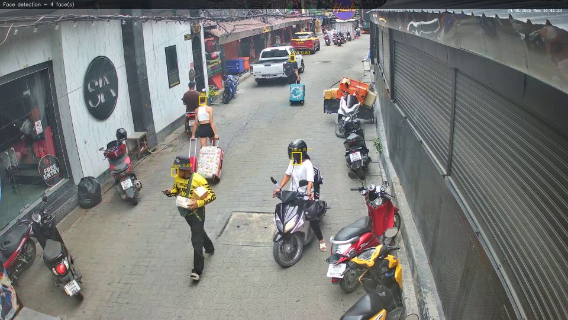

**Paths and speeds.** Trail, box and identity share one color per
object.


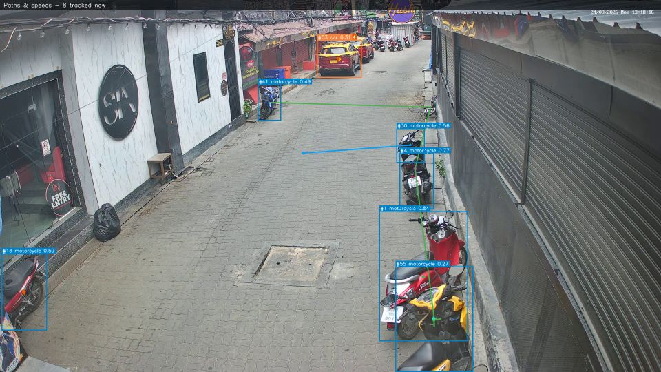

**Heat.** An hour and a half of dwell, burned into the pavement.

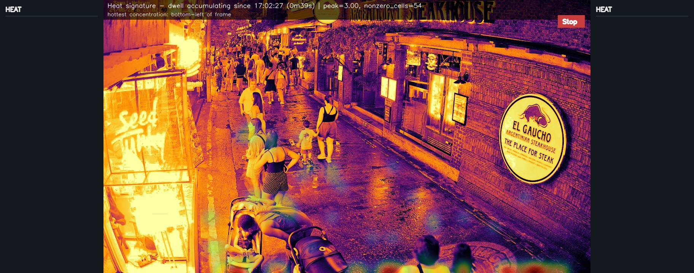
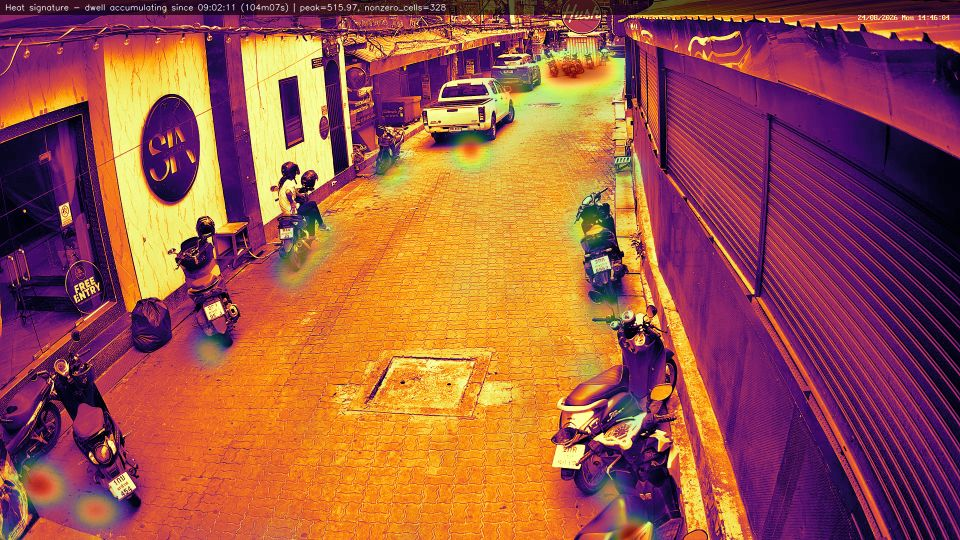

**Line crossing.** 37 in, 44 out, counted on foot-of-box side flips.

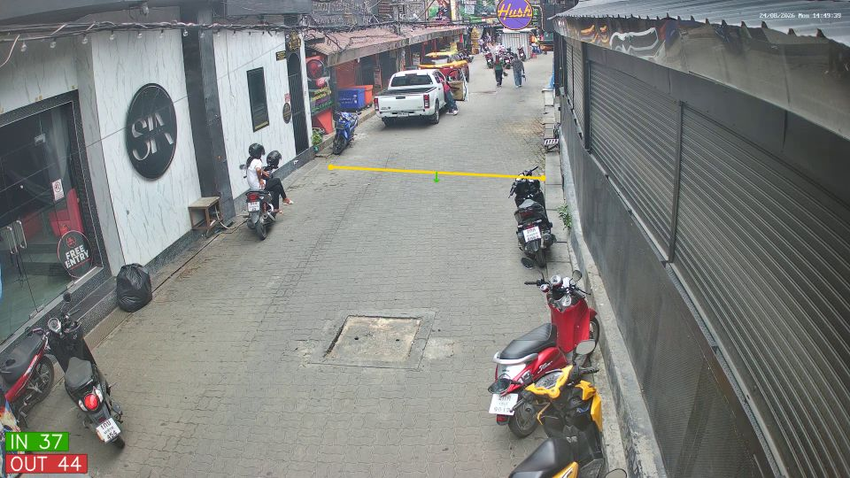
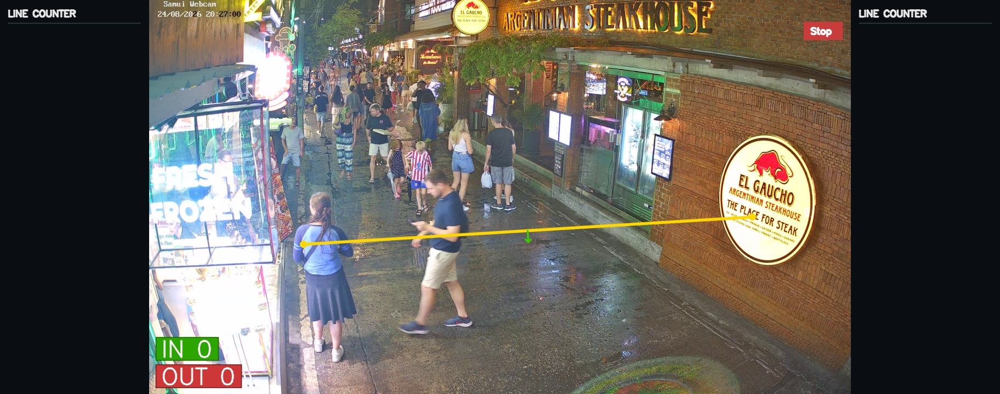

**Fire.** The detector confirming a real bonfire at 0.95 - and staying
silent on fire-free streets.

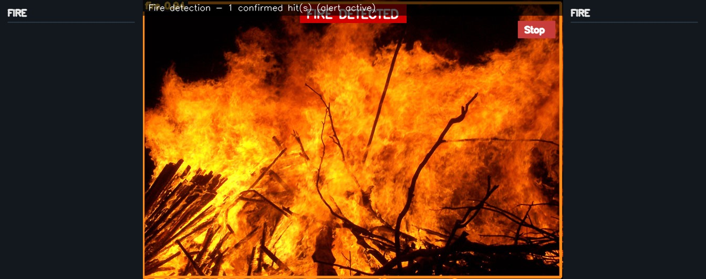

**Parking.** Seven spots the system drew for itself, two occupied.

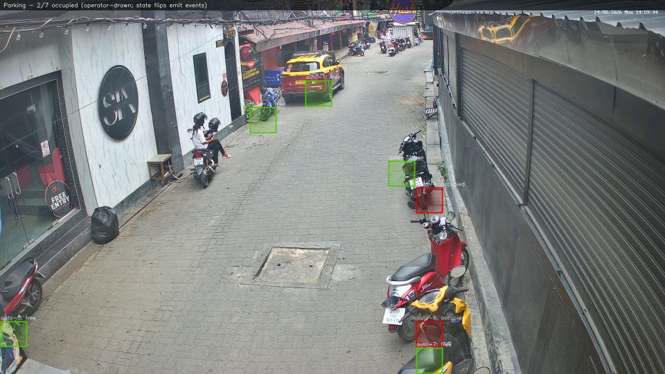
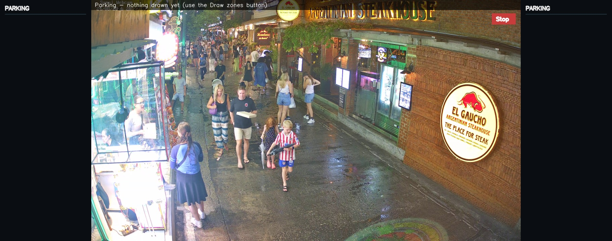

**License plates.** The full pipeline view with the audit trail of real
reads.

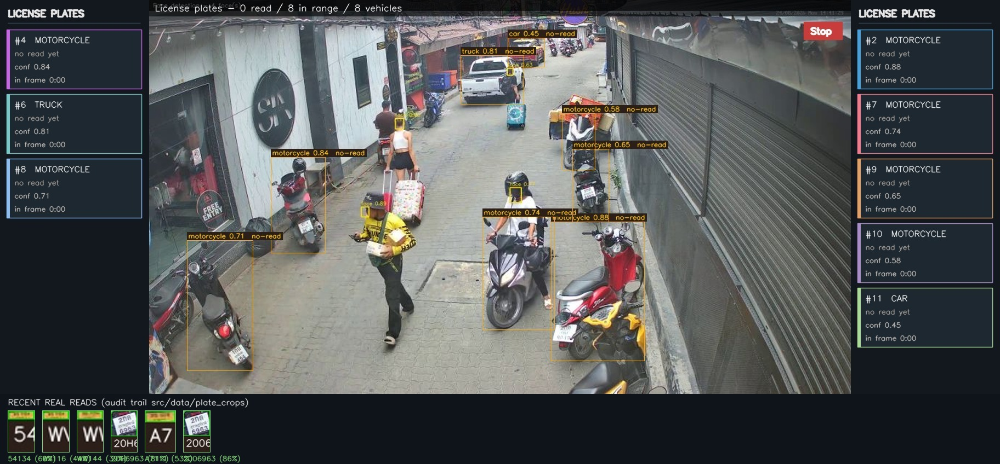

## The engine

| Model | Role |
|---|---|
| YOLO26-X (OpenVINO CPU) | Primary detector for every layer. |
| yolov11-S plate finetune | LPR stage 1 - locate the plate inside a vehicle crop. |
| fast-plate-ocr cct_s_v2 | LPR stage 2 - Latin OCR, with Thai/Arabic/Japanese fallbacks. |
| yolov8-S pose | COCO-17 keypoints for Pose, Gestures and Body. |
| YOLO26 fire finetune | Fire + smoke classes, verified on real fire imagery. |
| YuNet | Face detection with two-scale far-face rescue. |
| MediaPipe HandLandmarker | 21 hand landmarks for open palm / fist / pointing. |
| OSNet x0.25 | Person re-identification embeddings. |
| ESPCN x4 | Super-resolution for tiny plate crops. |

Weights download themselves on first run; nothing binary lives in this
repository.

## The dashboard

- **Analysis** - the live tile: pick a camera, pick one layer, watch it
  draw. Boxes glide between backend ticks, alerts burn a red banner,
  and a per-layer HUD reports people, vehicles, tick time and alerts.
- **Investigation** - every saved detection as a gallery card with its
  full frame, layer, camera and clock, plus the per-attempt plate and
  face crops behind each read.
- **Model information** - every weight the pipeline can load, its role,
  size and location, with published reference metrics where the source
  publishes them.

## Quick start

```bash
pip install -r src/requirements.txt
jupyter notebook real_time_cv.ipynb
```

Run all cells, type one number to pick a camera, and the dashboard
opens at `http://localhost:8000`. Everything runs on your machine; no
cloud, no accounts, no uploads.

## How it holds up on real streets

- Every claim on screen is earned: a layer with nothing to show says so
  instead of decorating the frame.
- Alerts are debounced and double-confirmed - single-frame flicker
  never pages anyone.
- Plate reads pass a confidence floor, a length floor, per-country
  grammar and temporal agreement before they are believed.
- Saved crops are capped and rotated, so weeks of runtime cannot flood
  the disk.

## Layout

```
real_time_cv.ipynb          the end-to-end notebook
src/
  app/                      detection, tracking, layers, LPR, pose,
                            faces, hands, fire, dashboard server
  web/                      dashboard frontend (HTML/JS/canvas)
media/                      the gallery above, straight from live runs
```

Model licenses: Ultralytics YOLO (AGPL-3.0), morsetechlab plate
finetune, fast-plate-ocr (MIT), MediaPipe (Apache-2.0), OpenCV zoo
YuNet (Apache-2.0), community YOLO26 fire finetune, TF-ESPCN.
