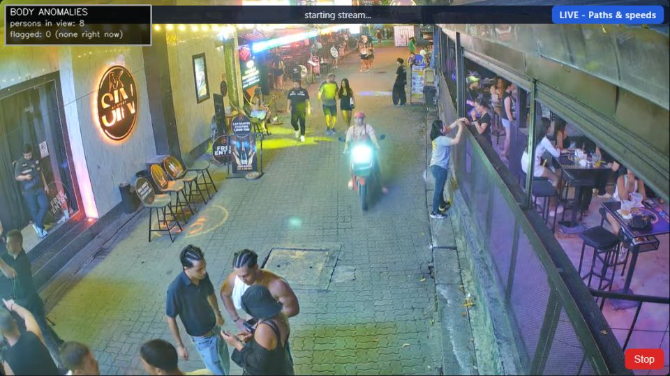
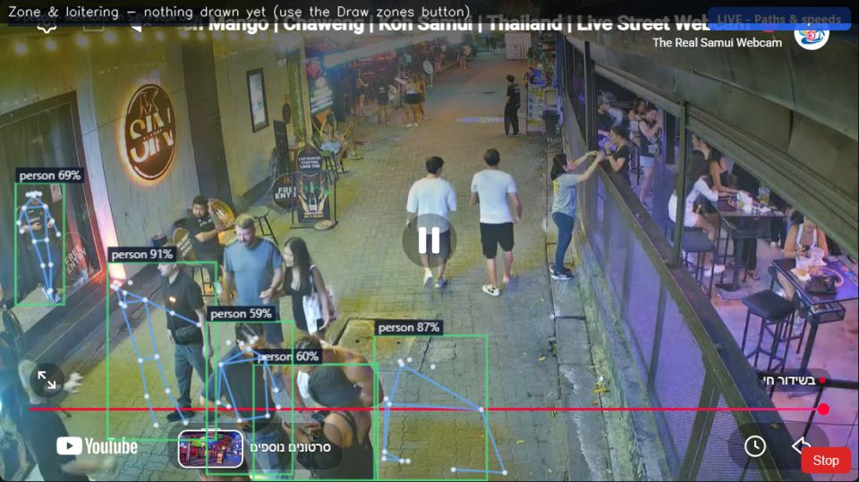

# Real-Time CV Object Tracking - YOLO26

Single-camera live analysis dashboard for public street webcams. Pick one
camera (Thailand catalog or an uploaded MP4/MKV), run YOLO26 detection plus
one of 10 analysis layers on top of the live video.

- **Frontend:** static HTML/JS + Chart.js. HLS via `hls.js`, YouTube via
  iframe embed. Canvas overlay draws boxes on top of the live video with
  client-side interpolation between backend detection ticks.
- **Backend:** small threaded HTTP server (`src/serve.py`) hosting the
  analysis endpoints and the static UI. YOLO26 runs on OpenVINO CPU cache.
- **Notebook:** `real_time_cv.ipynb` walks through single-frame check,
  footfall time-series, dwell tracking, re-ID and business score before
  binding the same dashboard inline for exploratory work.

## Live proof

The system was verified on the Soi Green Mango (Chaweng, Koh Samui) YouTube
webcam. Real-time boxes stick to real people; the counter updates every
tick; the annotated frame the backend produced is saved next to the repo:



*Green Mango, 8 persons in view, in/out counter live over the operator-drawn
line, motorcycle + pedestrian tracking, YOLO26x on OpenVINO CPU.*

Additional per-layer sample frames captured on the same camera are in
[`docs/proof/samples/`](docs/proof/samples/) (five frames per layer).

### Layer gallery

Two representative backend-rendered frames, both captured on the Soi
Green Mango live camera. Each frame is what the backend actually draws
before the JPEG leaves the process; the dashboard's canvas overlay draws
the same boxes on top of the live video for smoothness.


*Line crossing - operator-drawn line with in/out counters that
increment on foot-of-box side flips.*



*Zone & loitering - operator-drawn polygons, dwell clock per person
inside; alert fires when dwell crosses the per-zone threshold.*

## Table of contents

- [Quick start](#quick-start)
- [Prerequisites](#prerequisites)
- [What the model predicts](#what-the-model-predicts)
- [Camera catalog and video sources](#camera-catalog-and-video-sources)
- [Analysis layers](#analysis-layers)
- [Model files](#model-files)
- [Notebook](#notebook)
- [Dashboard](#dashboard)
- [Repository layout](#repository-layout)
- [Troubleshooting](#troubleshooting)
- [YouTube blocked by bot-check? Screen-capture fallback](#youtube-blocked-by-bot-check-screen-capture-fallback)

## Quick start

```bash
git clone https://github.com/orarr2/Real_Time_CV_Object_Tracking_YOLO26 real-time-cv-yolo26
cd real-time-cv-yolo26
python -m venv .venv
.\.venv\Scripts\activate            # Windows PowerShell
# source .venv/bin/activate         # macOS / Linux
pip install -r src/requirements.txt
cd src
python serve.py                     # opens http://localhost:8000
```

Alternatively:

```bash
jupyter lab real_time_cv.ipynb      # notebook at the repo root
```

Section 7 of the notebook binds the same dashboard on port 8000 with the
camera you pick in the notebook's picker cell.

## Prerequisites

- **Python 3.10 or newer** (yt-dlp dropped 3.9 support in 2025).
- **~1 GB free disk** for the shipped model weights plus their OpenVINO IR
  cache.
- **~2 GB free RAM** while running one live analysis session; add 200-400 MB
  per additional layer that loads its own ONNX model.
- **Chrome, Edge or Firefox** for the dashboard (needs `hls.js` and
  YouTube embed support).
- **Optional GPU:** not required. On integrated CPU (Intel UHD 620 class)
  YOLO26-m runs ~220 ms/frame via OpenVINO; a discrete GPU is strongly
  recommended once you want more than a single live session or an
  upgrade to `yolo26x` / `rtdetr-x`.

## What the model predicts

`yolo26m` is trained on COCO 80 classes; the engine keeps only the
classes relevant for street footfall and vehicle tracking:

| Group    | COCO classes kept                                           |
| -------- | ----------------------------------------------------------- |
| person   | `person`                                                    |
| vehicles | `car`, `motorcycle`, `bus`, `truck`, `bicycle`              |
| extras   | `train` (rail cameras), `dog` (optional)                    |

Everything else is discarded before the layers run. Each remaining
class gets its own box color in the overlay.

## Camera catalog and video sources

Cameras live in `src/app/cameras.py` as a plain Python dict. Each entry
declares a `kind`:

| `kind`         | Meaning                                                                                     |
| -------------- | ------------------------------------------------------------------------------------------- |
| `hls`          | Direct `.m3u8` manifest URL; consumed as-is.                                                |
| `youtube`      | A YouTube live URL. The frontend embeds the iframe player. The backend resolves an HLS URL via `yt-dlp` for frame grabbing (may require exported cookies - see [Troubleshooting](#troubleshooting)). |
| `skyline`      | A skylinewebcams.com page URL; resolved to a tokenised HLS URL per session.                 |
| `webcamera24`  | A webcamera24.com page URL; resolves to the embedded tvkur / YouTube stream.                |
| `local_file`   | Absolute path to an MP4/MKV/MOV/AVI/WEBM under `src/data/uploads/`.                         |

To add a new camera, drop a dict entry into `CAMERAS`. The catalog
endpoint (`/api/catalog`) picks it up on the next server start; no code
change beyond the entry itself.

## Analysis layers

Every layer draws on the same frame the operator is watching. One layer
runs per session; switching swaps the layer without restarting the
stream (accumulators are preserved).

| # | Layer      | What it draws                                                                    |
| - | ---------- | -------------------------------------------------------------------------------- |
| 1 | `paths`    | Per-track trail history plus a speed tier (slow / moving / fast).                |
| 2 | `pose`     | COCO-17 top-down skeleton on each person crop tall enough for legible keypoints. |
| 3 | `gestures` | Temporal arm gestures across recent frames (hand_raised, both_hands_up, wave).   |
| 4 | `body`     | Kinematic + gesture flags per person track.                                      |
| 5 | `faces`    | Face bounding boxes only (YuNet). No identification.                             |
| 6 | `line`     | Counting line drawn by the operator; increments in / out counters.               |
| 7 | `loiter`   | Dwell alerts on operator-drawn polygons.                                         |
| 8 | `parking`  | Occupancy flips (empty <-> filled) on operator-drawn polygons.                   |
| 9 | `plates`   | Two-stage LPR (yolov8n-plate + fast-plate-ocr) with per-track cache.             |
| 10 | `heat`    | 48x27 grid activity heatmap with 180 s half-life decay.                          |

## Model files

| File                                         | Role                                                                     |
| -------------------------------------------- | ------------------------------------------------------------------------ |
| `yolo26m.pt`                                 | Primary detector (person + vehicles + train).                            |
| `src/yolo26m_openvino_model/`                | OpenVINO IR cache for `yolo26m.pt` (2-3x faster on CPU).                 |
| `yolov8n-plate.pt` + `_openvino_model/`      | LPR stage 1: locate plate boxes inside a vehicle crop.                   |
| `plate_ocr_global.onnx`                      | LPR stage 2: Latin OCR (digits + A-Z, 9 slots).                          |
| `yolov8n-pose.pt` + `_openvino_model/`       | Top-down COCO-17 keypoints on person crops.                              |
| `models/FSRCNN_x4.pb`                        | 4x super-resolution applied to small plate / vehicle crops before OCR.   |
| `src/data/face_detection_yunet_2023mar.onnx` | YuNet face detector (bounding boxes only).                               |
| `src/data/osnet_x0_25_msmt17.onnx`           | OSNet re-identification embedding (falls back to HSV histogram if absent). |

All weights are committed to the repository so a fresh clone can serve
the dashboard without a second download step. Non-Latin OCR (Thai,
Arabic, Japanese) is enabled by installing `easyocr` and setting
`PLATE_OCR_LANGS=latin,th,ar,ja`.

## Notebook

`real_time_cv.ipynb` at the repo root walks the same pipeline the
dashboard uses:

1. Dependency check and model load.
2. Camera picker (list of `active_cameras()`).
3. Single-frame check.
4. Footfall time-series (`footfall_series`).
5. Rolling z-score anomaly flag + peak-hour profile.
6. Dwell / prolonged-stop analysis via `model.track()`.
7. Re-identification with `ReidStore`.
8. Business score (`business_score`).
9. **Live dashboard bind on port 8000** (`bind(PORT)` + IFrame).
10. Multi-site comparison (over the picked camera only in single-cam
    mode).
11. Live run summary.
12. Accuracy calibration (10a / 10b / 10c).

The notebook and the dashboard share the same detection code
(`src/app/`); the notebook is the exploratory surface, the dashboard is
the operator surface.

## Dashboard

`python serve.py` binds a local HTTP server on `http://localhost:8000`
and opens the browser to a single-page dashboard:

- **Analysis tab** - one full-width live tile with the picker on top and
  the analyze modal on the right.
- **Investigation tab** - saved detection samples (grid gallery).
- **Reinforcement learning tab** - review UI (currently disabled after
  the review-system removal; the header line still shows the last-known
  model accuracy when a `data/reviews.json` file exists).

The tile shows the live video (HLS `<video>` or YouTube iframe). When
an analysis session is running, a canvas overlays the video and draws
boxes / trails / heatmap cells. Boxes glide between backend ticks via
client-side interpolation and velocity extrapolation.

## Repository layout

```
real-time-cv-yolo26/
  README.md                         (this file)
  yolo26m.pt                        primary detector
  yolov8n-plate.pt + _openvino_model/
  yolov8n-pose.pt  + _openvino_model/
  plate_ocr_global.onnx             Latin plate OCR
  models/
    FSRCNN_x4.pb                    optional 4x super-resolution
  real_time_cv.ipynb                exploratory notebook (root)
  src/
    serve.py                        dashboard launcher
    requirements.txt
    app/                            detection + analysis engine
      detect_core.py                model load + resolve + grab_frame
      live_analysis.py              per-tick orchestration
      dashboard_server.py           HTTP endpoints
      cameras.py                    camera catalog
      tracker.py                    BurstTracker
      plates.py, pose.py, faces.py, gestures.py, heatmap.py,
      behavior.py, presence.py, reid.py, reid_embed.py,
      local_producers.py, live_samples.py, model_metrics.py,
      anomaly_crops.py, __init__.py
      yolo26m_openvino_model/       OpenVINO IR for the primary detector
    data/
      face_detection_yunet_2023mar.onnx
      osnet_x0_25_msmt17.onnx
      uploads/                      uploaded videos land here
    web/
      index.html, app.js, cameras.js
      snapshots/                    saved detections + review crops
    tests/                          pytest suite
    tools/
      calibrate_conf.py             per-camera confidence calibration CLI
    docs/
      PROJECT_GUIDE.md              deep-dive (English)
      PROJECT_GUIDE_HE.md           deep-dive (Hebrew)
      NOTEBOOK_MAIN_HE.md           notebook walkthrough (Hebrew)
```

## Troubleshooting

**YouTube camera stuck on "stream unavailable - retrying...":** the
backend uses `yt-dlp` to resolve the live HLS URL. YouTube's bot check
frequently blocks non-authenticated requests. Export cookies from a
signed-in Chrome session with the "Get cookies.txt LOCALLY" extension
and set:

```bash
YT_COOKIES_FILE=<path/to/cookies.txt> python serve.py
```

If cookies alone still fail (this IP got fingerprinted by YouTube), use
the screen-capture fallback described below - the iframe keeps playing
the video and YOLO reads pixels straight off the operator's display.

**YouTube iframe shows "Error 153":** the video owner disabled embed for
that specific stream. Try a different Thailand camera or upload a local
MP4.

**Port 8000 already in use:** `python serve.py --port 8765` picks a
different port. The notebook Section 7 hardcodes 8000; edit the `PORT`
variable in that cell if you already have something on 8000.

**Model header shows "loading..." forever:** the `data/reviews.json`
file is missing or unreadable. The Review UI was removed with the code
cleanup so this endpoint returns an empty state; the header falls back
to "Model: no feedback yet".

**`ModuleNotFoundError: No module named 'app.visual_search'`:** left
over from a partial upgrade. The visual-search feature was removed;
`src/app/anomaly_crops.py` is now a stub that returns an empty summary.

**`ImportError` in a test file:** the tests for the removed subsystems
(`test_visual_search.py`, `test_review_queue.py`,
`test_relabel_export.py`, `test_calibrate_conf.py` etc.) were deleted
along with their modules. Re-run `pytest src/tests/` after a `git
clean` to make sure no stale caches remain.

## YouTube blocked by bot-check? Screen-capture fallback

When YouTube returns "Sign in to confirm you're not a bot" and cookies
alone stop working, the backend can grab pixels off the operator's
primary display (whatever the browser tab is currently showing) instead.
Detection then runs on those pixels exactly as if the iframe were a
first-class stream.

**Enable it:**

```bash
SCREEN_CAPTURE_FALLBACK=1 YT_COOKIES_FILE=<cookies> python serve.py
```

The notebook opts in automatically (`os.environ.setdefault('SCREEN_CAPTURE_FALLBACK','1')`
lives in cell 4).

**How it works:** `src/app/screen_capture.py` uses `mss` (DXGI Desktop
Duplication on Windows, XShm on Linux, Quartz on macOS) with a
`PIL.ImageGrab` fallback. `src/app/detect_core.py:_resolve_uncached`
catches the `yt-dlp` failure and returns a `screen://primary` sentinel;
`grab_frame` recognises the sentinel and returns the current screen
region.

**Region to capture:** point the backend at the iframe's on-screen
rectangle so it doesn't grab your whole desktop:

```bash
curl -X POST http://localhost:8000/api/screen-capture/bbox \
  -H "Content-Type: application/json" \
  -d '{"x1":463,"y1":436,"x2":1438,"y2":985}'
```

The dashboard's Analyze button also POSTs this bbox automatically on
each start (it measures the iframe's `getBoundingClientRect()` and
multiplies by `devicePixelRatio`), so most operators don't need the curl
call.

**Operator requirement:** the Chrome window with the dashboard tab must
be visible on the primary display during capture. If you switch to
another window mid-analysis, subsequent frames capture whatever is on
screen instead - the session survives (`_LAST_GOOD_FRAME` cache keeps
inference alive) but detection stalls until the video is visible again.
